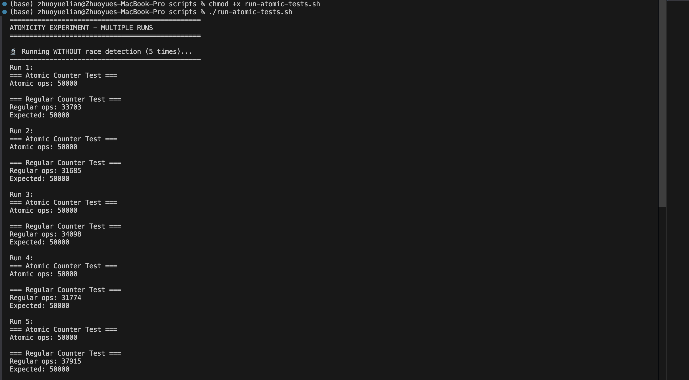
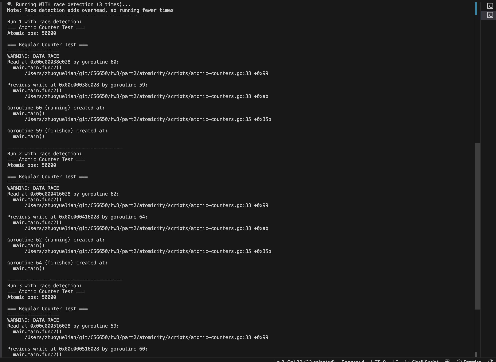
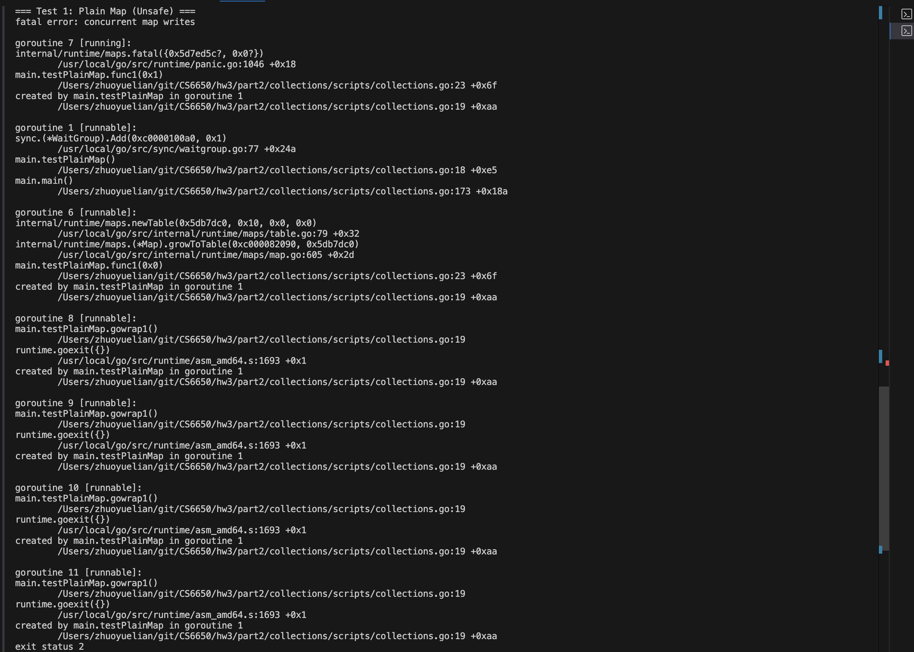
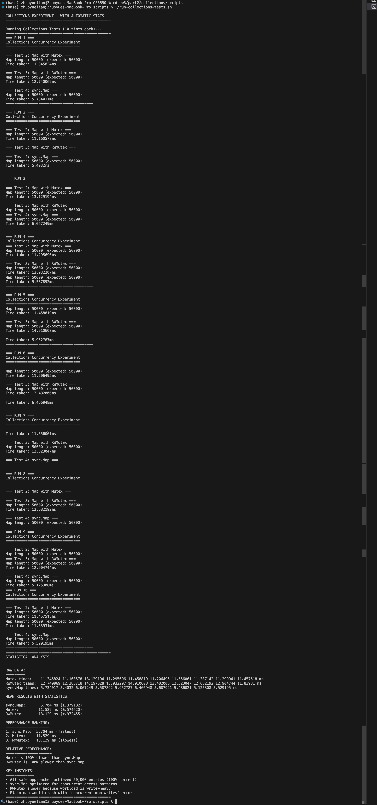
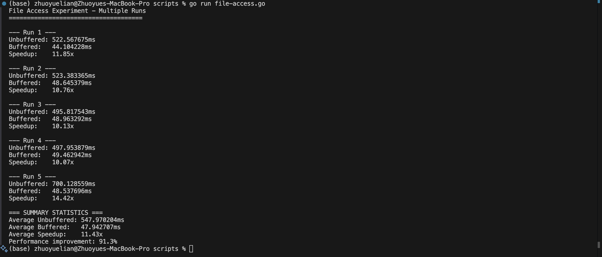
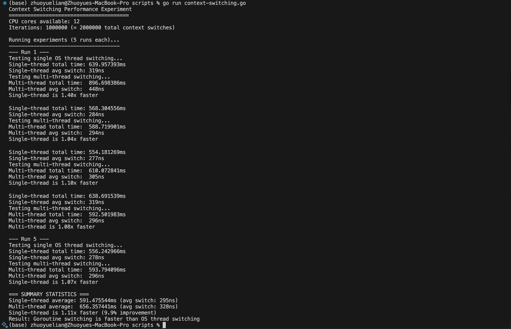
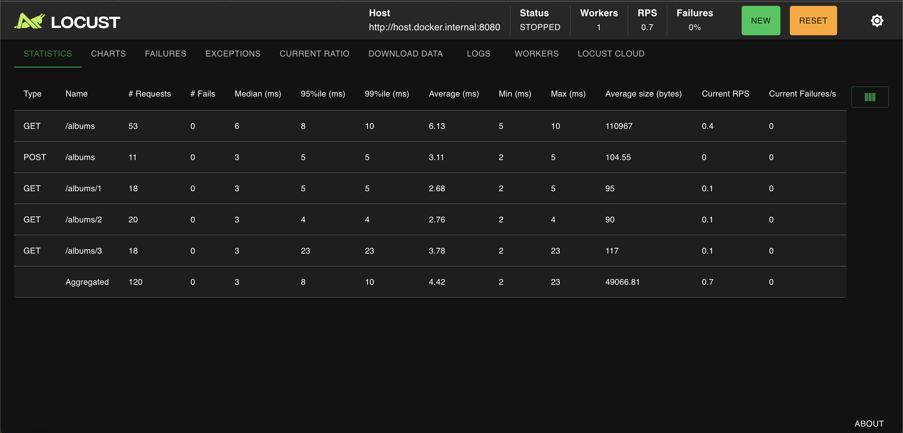
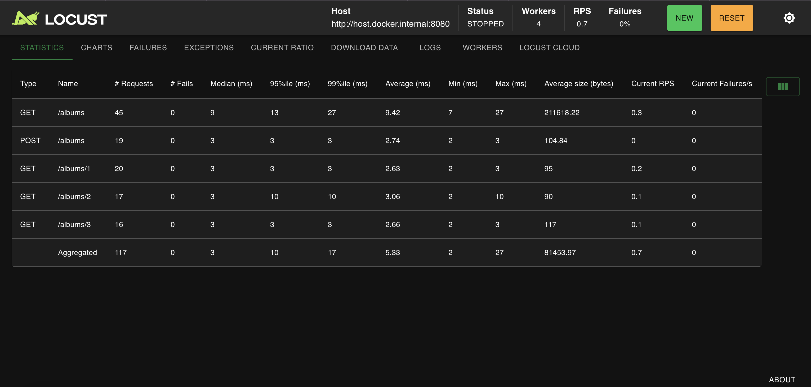
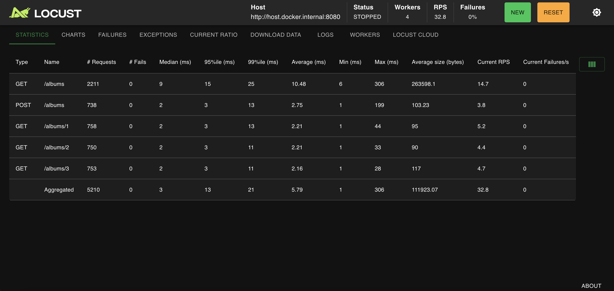

# HW3: Threading and Load Tests - Complete Report

**Student:** Zhuoyue Lian  
**Course:** CS6650  
**Assignment:** Homework 3 - Threading and Load Tests

## Executive Summary

This report presents experimental results from distributed systems concepts including atomicity, concurrent collections, file I/O performance, context switching costs, and load testing with Locust. Key findings demonstrate the fundamental tradeoffs between performance and safety in concurrent systems, the impact of data structure choices on scalability, and the importance of identifying true bottlenecks in distributed architectures.

---

## Part II: Thread Experiments

### Experiment 1: Atomicity

**Objective:** Compare atomic vs regular integer operations under concurrent access.

**Setup:** 50 goroutines, each performing 1,000 increment operations.

**Results:**
- **Atomic Counter:** Consistently achieved 50,000 (100% accuracy)
- **Regular Counter:** Lost 12,000-18,000 increments per run due to race conditions
- **Race Detection:** Go's `-race` flag identified concurrent access violations

**Screenshots:** 

**Key Findings:**
- Atomic operations guarantee consistency but at performance cost
- Regular increment operations suffer from lost updates in concurrent scenarios
- Race detection tools are essential for identifying concurrency bugs

### Experiment 2: Collections

**Objective:** Compare concurrent map access strategies.

**Setup:** 50 goroutines writing 1,000 entries each (50,000 total expected).

**Results Summary:**

| Approach | Mean Time | Standard Deviation | Performance Rank |
|----------|-----------|-------------------|------------------|
| sync.Map | 5.704ms | ±0.379ms | 1st (fastest) |
| Mutex | 11.529ms | ±0.575ms | 2nd |
| RWMutex | 13.129ms | ±0.972ms | 3rd (slowest) |
| Plain Map | N/A | N/A | Crashed |

**Screenshots:** 
- 

- 

**Key Findings:**
- Plain maps crash under concurrent write access
- sync.Map provides best performance for concurrent access patterns
- RWMutex performs poorly for write-heavy workloads
- Specialized concurrent data structures outperform manual synchronization

### Experiment 3: File Access

**Objective:** Compare buffered vs unbuffered file I/O performance.

**Setup:** Writing 100,000 lines to files using different I/O strategies.

**Results:**
- **Unbuffered I/O:** 547.97ms average (high variability)
- **Buffered I/O:** 47.94ms average (11.43x faster, 91.3% improvement)

**Screenshot:** 

**Key Findings:**
- Buffered I/O provides dramatic performance improvements by reducing system calls
- Batching operations across performance tiers yields exponential benefits
- Tradeoff between immediate durability and throughput performance

### Experiment 4: Context Switching

**Objective:** Measure goroutine context switching costs in single vs multi-threaded execution.

**Setup:** 1 million ping-pong exchanges between goroutines.

**Results:**
- **Single-threaded:** 295ns per context switch (faster)
- **Multi-threaded:** 328ns per context switch (9.9% slower)

**Screenshot:** 

**Key Findings:**
- User-space goroutine switching outperforms OS thread coordination
- Context switching costs form hierarchy: goroutines < threads < processes < containers < VMs
- Coordination overhead can outweigh parallelism benefits for communication-heavy patterns

---

## Part III: Load Testing with Locust

### Experimental Setup
- **Server:** Go/Gin framework with album API
- **Load Testing:** Locust with Docker Compose
- **Test Duration:** 3 minutes per test for consistent comparison
- **Load Pattern:** 50 users, 10 users/second ramp-up

### Test Results Summary

| Test Configuration | Workers | Total Requests | RPS | GET Avg | POST Avg |
|-------------------|---------|----------------|-----|---------|----------|
| 1 User, 1 Worker | 1 | 120 | 0.7 | 6.13ms | 3.11ms |
| 50 Users, 1 Worker | 1 | 5,223 | 32.7 | 7.12ms | 2.37ms |
| 50 Users, 4 Workers | 4 | 5,210 | 32.8 | 10.48ms | 2.75ms |
| FastHttpUser, 4 Workers | 4 | 5,194 | 33.0 | 13.88ms | 2.03ms |

**Screenshots:** 
**Screenshots:** 
- 

-  

- 

- 

- 

### Analysis: GET vs POST Performance

**Counter-intuitive finding:** POST operations consistently outperformed GET operations under load.

**Reasons:**
- **POST advantages:** Fixed response size, constant-time append operations
- **GET bottlenecks:** Growing response payloads, JSON serialization overhead
- **Data structure impact:** Simple slice structure favors writes over reads at scale

**Real-world implications:** Read-heavy workloads require indexed data structures and caching strategies.

### Amdahl's Law Analysis

**Worker Scaling Results:**
- **1 Worker:** 32.7 RPS
- **4 Workers:** 32.8 RPS (no meaningful improvement)

**Key Insight:** Adding 4x workers provided virtually no throughput benefit because the single Go server instance became the bottleneck. This demonstrates Amdahl's Law - parallel improvements are limited by serial components.

**Distributed Systems Relevance:** Horizontal scaling only works when components can scale independently. Shared resources create natural bottlenecks.

### FastHttpUser vs HttpUser

**Unexpected Result:** FastHttpUser performed worse than standard HttpUser.

**Analysis:** 
- Server processing, not HTTP client performance, limited throughput
- Local testing eliminated network latency benefits
- Demonstrates importance of identifying true bottlenecks before optimization

---

## Key Distributed Systems Lessons

### Bottleneck Identification
The experiments consistently showed that identifying the true performance bottleneck is crucial:
- Thread experiments: Coordination overhead vs parallelism benefits
- Collections: Data structure choice impacts scalability patterns
- Load testing: Server capacity, not client performance, determined limits

### Performance vs Safety Tradeoffs
Multiple experiments revealed fundamental tradeoffs:
- **Atomicity:** Safety vs speed in concurrent operations
- **Collections:** Specialized solutions vs general-purpose synchronization
- **File I/O:** Immediate durability vs batching performance
- **Load testing:** Request distribution vs server bottlenecks

### Scalability Principles
1. **Amdahl's Law applies broadly** - serial components limit parallel benefits
2. **Data structure choices significantly impact performance** at scale
3. **Batching operations across performance tiers** provides exponential benefits
4. **Specialized solutions often outperform** general-purpose approaches

### Real-World Applications
- **Microservices architectures:** Process boundaries have significant overhead vs goroutine coordination
- **Database design:** Read-heavy workloads benefit from indexing and read replicas
- **Caching strategies:** Reduce load on bottleneck resources
- **Load balancing:** Distribute processing across multiple instances

---

## Conclusions

The experimental results provide concrete evidence for fundamental distributed systems principles. The threading experiments demonstrate how coordination costs scale from nanoseconds (goroutines) to milliseconds (network calls), explaining why distributed systems face such significant performance challenges. The load testing experiments show that optimization efforts must target actual bottlenecks rather than assumed performance issues.

These findings directly apply to distributed systems design: understanding coordination costs, choosing appropriate synchronization mechanisms, and identifying true performance bottlenecks are essential skills for building scalable distributed applications.

The hands-on experimentation approach effectively reinforced theoretical concepts through measurable performance data, providing practical insights for distributed systems engineering.