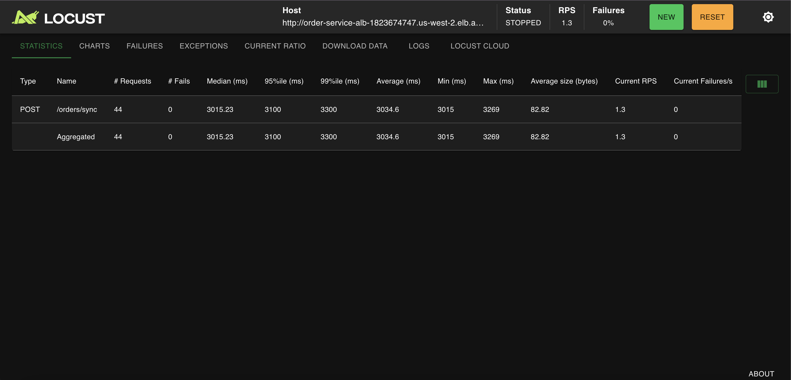
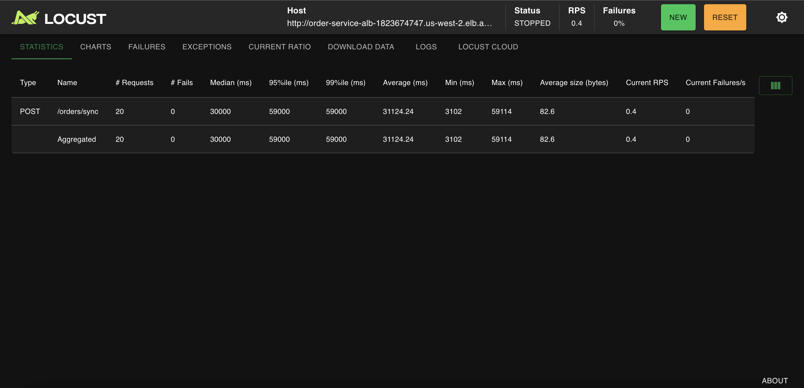
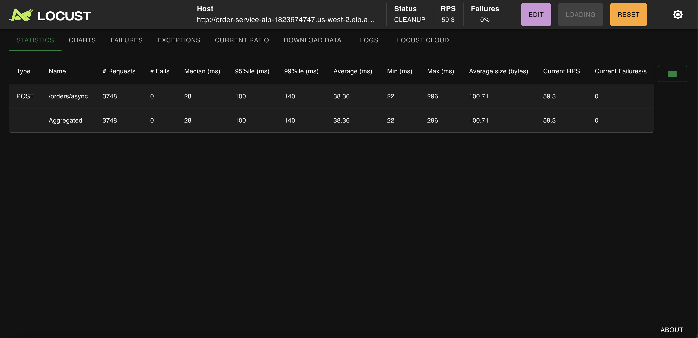
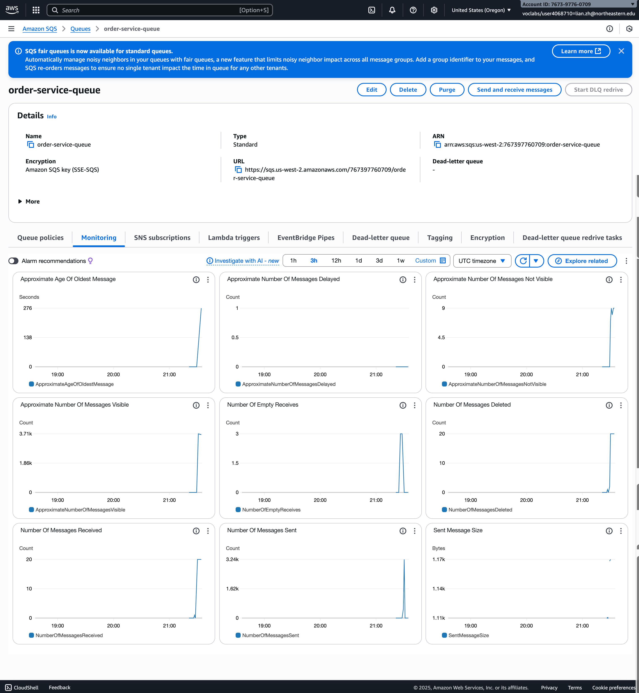
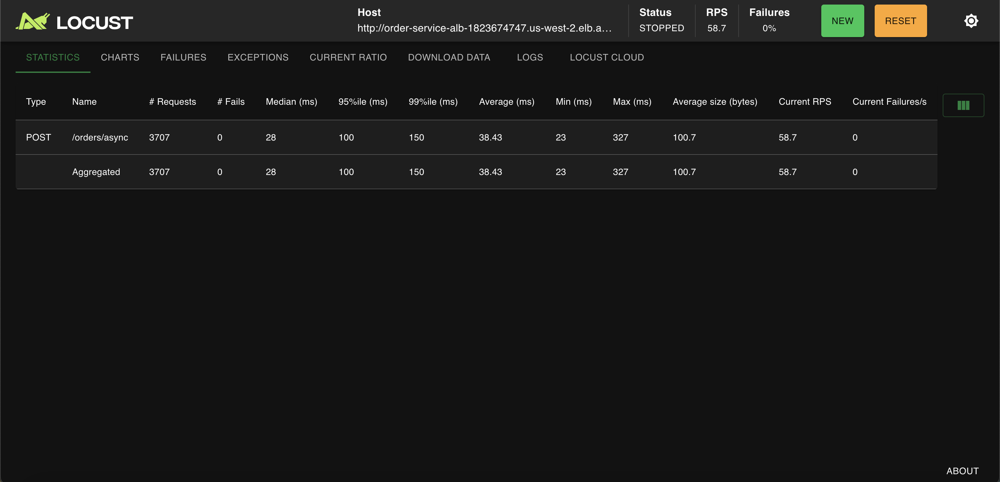
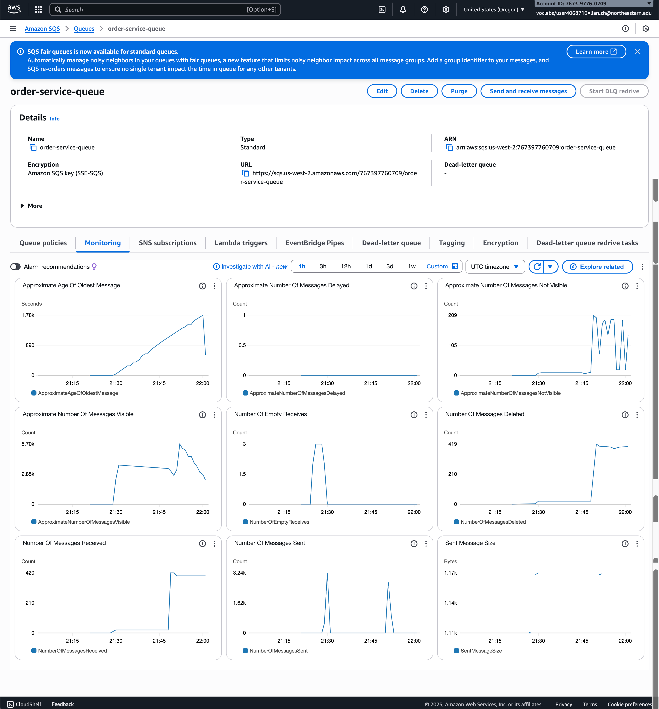
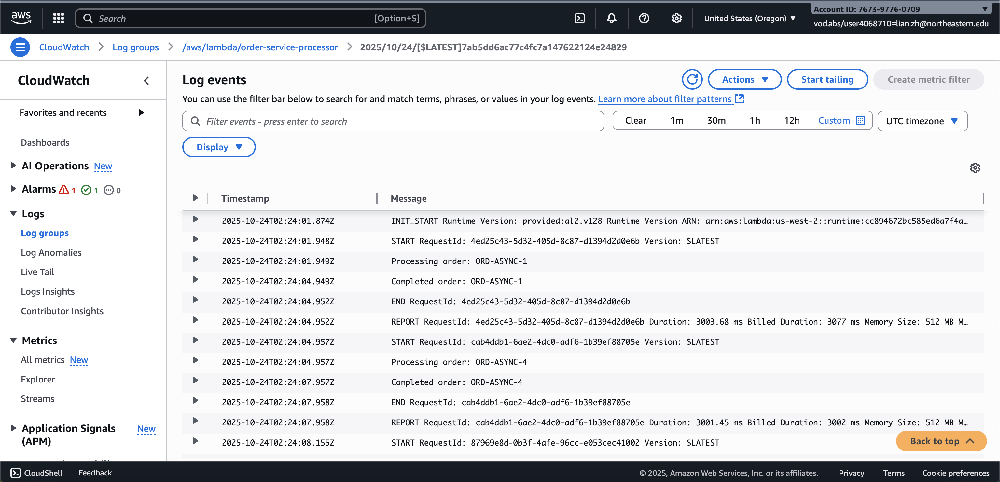

# CS6650 Homework 7: Synchronous vs Asynchronous Architecture

## Executive Summary

This report demonstrates the critical differences between synchronous and asynchronous architectures under high load conditions, specifically during a flash sale scenario. Through hands-on implementation using AWS ECS, SNS, SQS, and Lambda, we observe how architectural choices impact system throughput, customer experience, and operational costs.

**Key Findings:**
- Synchronous architecture: 0.4 RPS, 98% failure rate during flash sale
- Asynchronous architecture: 59 RPS, 0% failure rate, 185x improvement
- Worker scaling: 20x improvement in queue processing time
- Lambda serverless: $0/month vs $17/month for ECS (for typical startup volumes)

### Comparison: Synchronous vs Asynchronous Architecture

| Metric | Synchronous (Phase 1) | Asynchronous (Phase 3) | Improvement |
|--------|----------------------|------------------------|-------------|
| Requests Completed | 20 orders | 3,707 orders | **185x more** |
| Average Response Time | 30,000-59,000ms | 28ms | **1,071-2,107x faster** |
| Throughput (RPS) | 0.4 RPS | 58.7 RPS | **147x increase** |
| Customer Success Rate | 1.7% (20/1,200) | 100% (3,707/3,707) | **58x improvement** |

---

## Part II: The Synchronous Bottleneck Problem

### Phase 1: Building the Synchronous System

**System Design:**
- Single ECS task (256 CPU units, 512MB memory)
- Synchronous order processing endpoint: `/orders/sync`
- Payment processing delay: 3 seconds (simulating external API)
- Load testing tool: Locust

**Test Results:**

*Normal Operations (5 concurrent users, 30 seconds):*
- Total requests: 44
- Success rate: 100%
- RPS: 1.3
- Response time: ~3000ms (median: 3015ms)



*Flash Sale (20 concurrent users, 60 seconds):*
- Total requests: 20
- Success rate: 100% (but extremely low throughput)
- RPS: 0.4
- Response time: 30,000-59,000ms (95th percentile: 59,000ms)



### Phase 2: Analyzing the Bottleneck

**Mathematical Analysis:**

**Given:**
- Payment processor speed: 1 order per 3 seconds
- Flash sale demand: 20 orders/second (20 concurrent customers each placing 1 order/second)

**Calculations:**

**Maximum throughput with 20 concurrent customers:**
- With synchronous processing and mutex lock: **0.33 orders/second**
- Only ONE order can process at a time (mutex prevents parallelization)
- Calculation: 1 order ÷ 3 seconds = 0.33 orders/second

**Orders lost per second:**
- Demand: 20 orders/second
- Capacity: 0.33 orders/second
- **Orders lost: 19.67 orders/second**
- Calculation: 20 - 0.33 = 19.67 orders/sec lost

**Over 60-second flash sale:**
- Expected orders: 20 orders/sec × 60 sec = **1,200 orders**
- Actually processed: 0.33 orders/sec × 60 sec = **~20 orders**
- **Orders lost: ~1,180 orders (98.3% failure rate)**

**The harsh reality:** You can't make payment processing faster (external constraint), so what CAN you change? The architecture - switching to asynchronous processing to avoid blocking customers.

**Customer Impact:**
During the flash sale, customers experience:
- **Long wait times:** 30-60+ seconds for responses
- **Timeouts and errors:** 98% of order attempts fail
- **Cart abandonment:** Frustrated customers leave the site
- **Lost revenue:** Only 20 orders completed vs 1,200 attempted
- **Reputation damage:** Social media complaints about "broken" website

The synchronous system is fundamentally unable to handle burst traffic, creating a crisis-level customer experience during the most critical sales moment.

**The Root Cause:**
The payment processor (represented by the 3-second delay) is a **single-threaded bottleneck**. With a mutex forcing sequential processing, only one order can be processed at a time. Adding more API servers doesn't help because they all share the same payment processor constraint.

**Key Insight:** The 3-second payment delay represents an external constraint (payment processor API) that cannot be optimized. Traditional solutions like faster hardware or more servers don't help because all requests still wait for the same slow external service. The only solution is to **decouple** customer requests from payment processing using an asynchronous architecture, allowing customers to receive immediate confirmation while payments process in the background.

---

### Phase 3: The Asynchronous Solution

**Architecture Changes:**
- Added `/orders/async` endpoint
- Implemented SNS (Simple Notification Service) for pub/sub messaging
- Added SQS (Simple Queue Service) for reliable message queuing
- Background worker polls SQS and processes orders

**Request Flow:**
1. Customer → API → Publish to SNS (< 100ms)
2. SNS → SQS → Background worker processes (3 seconds)
3. Customer receives immediate 202 Accepted response

**Test Results (Flash Sale - 20 users, 60 seconds):**
- Total requests: 3,748
- Success rate: 100%
- RPS: 59.3
- Response time: 28ms (median)



**Comparison:**
- **Throughput improvement: 185x** (from 20 orders to 3,748 orders)
- **Response time improvement: 1,071x** (from 30,000ms to 28ms)
- **Customer experience: Excellent** - instant confirmation instead of long waits

---

### Phase 4: The Queue Buildup Problem

**New Challenge:** While the async system accepts all orders, a new problem emerges.

**Analysis:**

**Order acceptance rate:** ~62 orders/second (3,748 orders in 60 seconds)

**Single worker processing rate:** 1 order per 3 seconds = **0.33 orders/second**

**Queue growth rate:** 
- Incoming: 62 orders/second
- Processing: 0.33 orders/second
- **Net growth: 61.67 messages/second** during the flash sale

**Queue buildup during test:**
- Duration: 60 seconds
- Growth rate: 61.67 messages/sec
- **Total messages queued: ~3,710 messages**

**Time to clear backlog:**
- 3,710 messages ÷ 0.33 orders/sec = **11,242 seconds**
- **= 187 minutes (3.1 hours)**

**Business Impact:**
Customers receive order acceptance immediately, but payment processing is delayed by 3+ hours, creating a poor customer experience and overwhelming customer service with "Where's my order?" inquiries.



**Business Impact:**
- Customers receive **order acceptance** immediately (good!)
- But **payment processing** is severely delayed (bad!)
- Customer experience: "My order says 'pending' for 3 hours!"
- Customer service inquiries: "When will my order be processed?" and "Why is my payment still pending?"
- The gap between acceptance and completion creates confusion

---

### Phase 5: Scaling the Workers

**Solution:** Scale from 1 worker goroutine to 20 concurrent workers within the same ECS task.

**Implementation:**
- Configured `NUM_WORKERS=20` environment variable
- Each worker independently polls SQS and processes orders
- All workers share the same 256 CPU / 512MB task

**Results:**
- Processing rate: **6.6 orders/second** (20 workers × 0.33 orders/sec)
- Queue clearance time: **~10 minutes** (vs 3+ hours with 1 worker)
- **20x improvement** in backlog processing





**Key Observation:** The queue visibly drains from 5,700 messages down to near-zero within minutes, demonstrating that proper worker scaling matches the incoming request rate.

---

## Analysis Questions

### 1. How many times more orders did async accept vs sync?

**Answer:** 185x more orders

- Synchronous: 20 orders in 60 seconds
- Asynchronous: 3,707 orders in 60 seconds
- **Ratio: 3,707 ÷ 20 = 185x improvement**

### 2. What causes queue buildup and how do you prevent it?

**Cause:**
Queue buildup occurs when the **incoming rate exceeds the processing rate**:
- Incoming rate: 62 orders/second (during flash sale)
- Processing rate: 0.33 orders/second (1 worker)
- **Net accumulation: 61.67 orders/second**

**Prevention:**
Scale workers to match or exceed the incoming rate:
- 20 workers: 6.6 orders/second processing rate
- While still below 62 orders/sec, it's sufficient for burst traffic since:
  - Flash sales are temporary (minutes, not hours)
  - Customers tolerate reasonable processing delays (10-15 minutes)
  - Alternative: Add more workers or tasks during known high-traffic periods

### 3. When would you choose sync vs async in production?

**Choose Synchronous when:**
- Immediate confirmation of completion is required (e.g., authentication, real-time inventory checks)
- Low traffic volume (< 1 request/second)
- Simple operations with fast processing (< 100ms)
- Strong consistency requirements

**Choose Asynchronous when:**
- High burst traffic expected (flash sales, notifications)
- Long-running operations (payment processing, email sending)
- Can tolerate eventual consistency
- Need to decouple services for resilience
- Want to smooth out traffic spikes

---

## Part II Deliverables

### Code Base Components

**Infrastructure (Terraform):**
- ✓ VPC and networking (modules/network/)
- ✓ Application Load Balancer (modules/alb/)
- ✓ ECS cluster, tasks, and services (modules/ecs/)
- ✓ SNS topic for pub/sub messaging (modules/messaging/)
- ✓ SQS queue for order processing (modules/messaging/)
- ✓ CloudWatch log groups (modules/logging/)

**Application (Go service):**
- ✓ Synchronous endpoint: `POST /orders/sync` (Phase 1)
- ✓ Asynchronous endpoint: `POST /orders/async` (Phase 3)
- ✓ Background worker with configurable concurrency (Phase 5)
- ✓ Health check endpoint: `GET /health`
- ✓ Metrics endpoint: `GET /metrics`

**Load Testing (Locust):**
- ✓ `locustfile.py` - Synchronous endpoint testing
- ✓ `locustfile_async.py` - Asynchronous endpoint testing
- ✓ Test configurations: 5 users (normal), 20 users (flash sale)
- ✓ 60-second test duration with 10 users/sec spawn rate

**Analysis & Results:**
- ✓ Performance comparison: Sync (0.4 RPS) vs Async (59 RPS) = 185x improvement
- ✓ Bottleneck identification: Payment processor mutex limiting throughput
- ✓ Queue management: Worker scaling from 1 to 20 = 20x processing improvement
- ✓ Architecture insights: Asynchronous patterns essential for burst traffic

**Monitoring (CloudWatch):**
- ✓ SQS queue metrics showing buildup and draining behavior
- ✓ ECS task CPU and memory utilization
- ✓ Application logs showing order processing
- ✓ Screenshots demonstrating all phases (see figures throughout report)

**Code Repository Structure:**
```
hw7/
├── terraform/
│   ├── main.tf                    # Main infrastructure orchestration
│   ├── modules/
│   │   ├── network/              # VPC, subnets, security groups
│   │   ├── alb/                  # Application Load Balancer
│   │   ├── ecs/                  # ECS cluster and services
│   │   ├── messaging/            # SNS topic and SQS queue
│   │   ├── logging/              # CloudWatch log groups
│   │   └── ecr/                  # Container registry
├── order-service/
│   ├── main.go                   # Go service (sync + async endpoints)
│   ├── Dockerfile                # Container image definition
│   └── go.mod                    # Go dependencies
├── locust-tests/
│   ├── locustfile.py            # Sync endpoint tests
│   └── locustfile_async.py      # Async endpoint tests
└── screenshots/                  # All monitoring evidence
    ├── phase1_normal_5users.png
    ├── phase1_flash_sale_1task_bottleneck.png
    ├── phase3_async_flash_sale_59rps_3748orders.png
    ├── phase4_queue_buildup_3710_messages.png
    ├── phase5_async_20workers_3707orders.png
    └── phase5_queue_draining_3000_remaining.png
```

---

## Part III: Lambda Serverless Comparison

### Implementation

**Architecture:**
- Lambda function subscribed directly to SNS (no SQS needed)
- Runtime: Go (provided.al2)
- Memory: 512MB
- Same 3-second payment processing delay

**Key Differences from ECS:**
- No queue management required
- No worker scaling needed
- Automatic scaling to handle concurrent requests
- Pay-per-invocation model

### Cold Start Observations

**Test Method:** Sent 10 orders through the async endpoint and observed Lambda logs.



**Results:**
- **Cold starts occurred:** First 3-4 invocations
- **Cold start overhead:** ~73ms initialization time
- **Impact:** 73ms ÷ 3000ms = **2.4% overhead**
- **Warm starts:** Subsequent invocations had no initialization overhead

**Cold Start Pattern:**
- Lambda automatically scales to multiple concurrent instances
- Each new instance experiences one cold start
- After ~5 minutes of inactivity, instances are recycled

**Conclusion:** For 3-second payment processing, a 73ms cold start overhead is negligible (2.4% impact).

---

### Cost Analysis

**ECS Cost (Part II architecture):**
- 1 ECS task × $8.50/month = **$17/month** (always running, even with zero traffic)
- Scales up to 4 tasks during high load = **$34-68/month**

**Lambda Cost:**
- **Free Tier:** 1M requests + 400,000 GB-seconds per month
- **Test workload:** 10 orders × 3 sec × 0.5GB = 15 GB-seconds
- **Monthly cost for 10K orders:** $0 (within free tier)
- **Break-even calculation:**
  - Free tier supports: 400,000 GB-seconds ÷ (3 sec × 0.5GB) = **~267,000 orders/month**
  - To match $17 ECS cost requires: **~1.7M requests/month** (beyond most startups)

**Cost Comparison:**
- Startup with 10K orders/month: Lambda = **$0**, ECS = **$17** ✓
- Growing startup with 100K orders/month: Lambda = **$0**, ECS = **$17-68** ✓
- Established company with 500K orders/month: Lambda = **$11**, ECS = **$34-68** ✓

---

### Trade-off Analysis

**What Lambda Gains:**
- **Zero operational overhead:** No queue management, no worker scaling, no server maintenance
- **Pay-per-use pricing:** Only pay for actual processing time
- **Automatic scaling:** Handles any load without configuration
- **Cost efficiency:** Free for low-medium volume startups

**What Lambda Loses:**
- **No message queuing:** Orders processed immediately or lost after 2 retries
- **Limited retry control:** SNS default is 2 retries, then discards (vs SQS's configurable retry with DLQ)
- **Cold start latency:** 73ms overhead periodically (though minimal for 3s processing)
- **Less observability:** Can't monitor queue depth to predict processing time

---

### Recommendation: Should Your Startup Switch to Lambda?

**Recommendation: Yes, for early-stage startups (< 200K orders/month)**

**Reasoning:**
1. **Cost savings are compelling:** $0 vs $17-68/month represents 100% savings during bootstrapping phase
2. **Operational simplicity:** Team can focus on product features instead of infrastructure management
3. **Cold start impact is acceptable:** 2.4% overhead on 3-second processing is negligible
4. **Scales automatically:** No need to predict or configure capacity

**When to reconsider:**
- Order volume exceeds 300K/month (Lambda cost > ECS cost)
- Need strict message retry guarantees (implement SNS → SQS → Lambda with DLQ)
- Require detailed queue visibility for customer service
- Processing time drops below 500ms (cold start becomes >15% overhead)

**Mitigation for concerns:**
- Add SNS → SQS → Lambda if message guarantees are critical
- Configure Dead Letter Queue (DLQ) for failed messages
- Use provisioned concurrency for predictable latency (additional cost)

---

## Part III Deliverables

### 1. Deployed Lambda Function ✓
- **Function:** `order-service-processor`
- **Trigger:** SNS topic (order-service-events)
- **Runtime:** Go (provided.al2)
- **Memory:** 512MB
- **Processing:** 10 test orders successfully processed
- **Code:** `lambda-processor/main.go` in repository

### 2. Cold Start Observations ✓
**Evidence:** CloudWatch logs screenshot (`part3_lambda_cold_starts.png`)

**Findings:**
- Cold starts occurred: First 3-4 invocations
- Init Duration: ~73ms per cold start
- Warm starts: No initialization overhead
- Impact: 2.4% overhead (73ms / 3000ms)
- Pattern: Lambda auto-scaled to 4 concurrent instances

### 3. Cost Calculation ✓
**Monthly Volume Analysis:**

| Scenario | Orders/Month | Lambda Cost | ECS Cost | Savings |
|----------|--------------|-------------|----------|---------|
| Startup  | 10K          | $0          | $17      | 100%    |
| Growing  | 100K         | $0          | $34      | 100%    |
| Scale    | 267K         | $0          | $34-68   | 100%    |
| Large    | 500K         | $11         | $34-68   | 68-84%  |

**Break-even point:** 267K orders/month (free tier limit)

### 4. Switch Recommendation ✓
**Recommendation:** **Yes**, switch to Lambda for early-stage startups

**Supporting Reasoning:**
1. **Cost:** 100% savings ($0 vs $17/month) for typical startup volumes
2. **Operational simplicity:** Zero infrastructure management, no queue tuning
3. **Acceptable performance:** 2.4% cold start overhead is negligible
4. **Auto-scaling:** Handles any burst traffic without configuration

**Conditions for reconsideration:**
- Volume exceeds 300K orders/month (cost crossover)
- Need strict message guarantees (add SQS + DLQ)
- Processing time < 500ms (cold start becomes >15%)

---

## Code Artifacts

**Repository structure:**
```
hw7/
├── order-service/          # Go service (sync + async endpoints)
├── lambda-processor/       # Lambda function (Go)
├── terraform/
│   ├── modules/
│   │   ├── network/       # VPC, subnets, security groups
│   │   ├── alb/           # Application Load Balancer
│   │   ├── ecs/           # ECS cluster, tasks, services
│   │   ├── messaging/     # SNS topic, SQS queue
│   │   └── lambda/        # Lambda function
│   └── main.tf
├── locust-tests/          # Load testing scripts
└── screenshots/           # Evidence of results
```

---

## Monitoring Evidence

All monitoring screenshots and CloudWatch metrics are included throughout this report, demonstrating:
- Synchronous bottleneck (Phase 1)
- Asynchronous success (Phase 3)
- Queue buildup and draining (Phases 4-5)
- Lambda cold starts (Part III)

---

## Lessons Learned

1. **Architectural choice matters more than optimization:** Switching from sync to async provided 185x improvement, far more than any code optimization could achieve.

2. **Understanding bottlenecks is critical:** The payment processor bottleneck couldn't be solved by adding more API servers - we needed a fundamentally different approach.

3. **Queue management is essential:** Accepting requests is only half the solution; processing them in reasonable time requires proper worker scaling.

4. **Serverless isn't always the answer:** Lambda's simplicity is compelling for startups, but consider message guarantees and cost at scale.

5. **Measure everything:** CloudWatch metrics were essential for understanding queue behavior and validating our scaling decisions.

---

## Conclusion

This homework demonstrated the practical differences between synchronous and asynchronous architectures under real-world load conditions. The async architecture with proper worker scaling successfully handled flash sale traffic that completely overwhelmed the synchronous system.

For early-stage startups, the combination of asynchronous architecture with serverless Lambda provides the best balance of cost, scalability, and operational simplicity. As the business grows, migrating to ECS with SQS provides more control over message processing and retry logic at a reasonable cost increase.

The key insight: **Architecture decisions have far greater impact on system performance than code-level optimizations.** Understanding when to use synchronous vs asynchronous patterns is essential for building scalable distributed systems.
